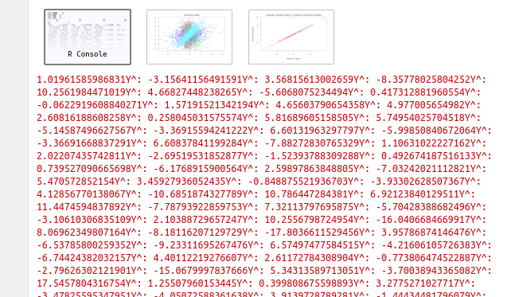
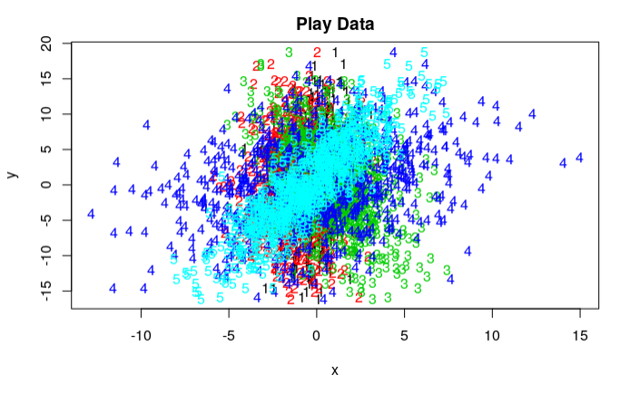
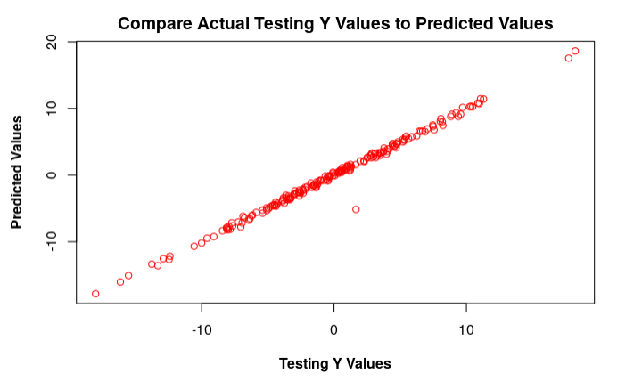

# Linear-Regression-in-R

**Content:**

Linear regression model used cross-validation with built in R function 'lm()'on dummy data. Intercepts calculated, predicted and actual values were plotted, and a linear correlation from the data was confirmed. 

**Images:Calculated Intercepts** 

**Images:Plotting of Actual vs. Predicted values** 

**Images:Linear Correlation** 

